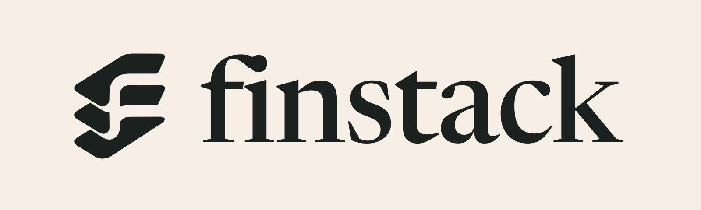

<h1 align="center">
  
</h1>

<p align="center">
  <a href="https://github.com/kohoj/finstack/actions/workflows/ci.yml"></a>
  <a href="LICENSE"></a>
  <a href="https://bun.sh"></a>
</p>

**An operating system for investment thinking.**

One person + AI = a hedge fund's entire research department.

finstack is a [Codex](https://developers.openai.com/codex) plugin that turns
your terminal into an institutional-grade investment research workflow. Not a
data terminal — a thinking partner that argues, traces chain reactions, screens
for opportunities, remembers your blind spots, and gets smarter with every
decision you make.

## Why not just use...

| | What it gives you | What it doesn't |
|---|---|---|
| **A Bloomberg Terminal** | Every number, instantly | It answers "what is the price." It does not argue with your thesis, and it costs more per year than most people's portfolios. |
| **ChatGPT in a browser** | Good reasoning on demand | No memory between sessions. It cannot tell you that you exited three tech positions early last quarter, because it does not know you did. |
| **A quant framework** | Backtests and optimization | It assumes the strategy is the hard part. For most people the hard part is following their own plan. |
| **A portfolio tracker** | What you own and what it's worth | It records outcomes. It cannot separate a good decision from a lucky one. |

finstack's specific claim is the last row. It maintains a shadow portfolio — a
disciplined version of you that follows every plan exactly — and the gap between
the two is a number: how much your execution costs you, attributed to a named
behavioral pattern.


## The Loop

Nine skills. `/judge` is the hub — it is where a signal becomes a decision, so
six of the other eight point at it.

```
  screen ──┐                    ┌──► act ──┐
           ├──► research ──┐    │          │
           │               ▼    │          │
  sense ───┴──────────► JUDGE ──┤          │
           │               ▲    │          │
           └──► cascade ───┘    └──► cascade
                                          │
  track ──► reflect ──► sense             │
     ▲                                    │
     └────────────────────────────────────┘
```

Enter anywhere, leave anywhere. Underneath runs a second loop that nothing in
the interface names — `/act` writes a disciplined plan, `/track` measures your
deviation from it, `/reflect` names the pattern, and `/act` warns you about it
next time. That is the mechanism by which the system gets sharper, and it is
described in [ARCHITECTURE.md](ARCHITECTURE.md#the-shadow-portfolio-loop).

### Core Skills

| Skill | Purpose |
|-------|---------|
| **`/sense`** | Morning briefing. Scans portfolio + watchlist + alerts, filters noise, surfaces only what matters. |
| **`/research`** | Deep dive. Produces research memorandums with traceable claims. |
| **`/judge`** | Adversarial judgment. Bull vs Bear with conditional confidence — not fake scores. |
| **`/act`** | Action plan. Position sizing, stop-loss, take-profit, risk gate, correlation check. |
| **`/cascade`** | Chain reaction tracing. Multiple agents trace parallel causal chains simultaneously. |
| **`/track`** | Quantified mirror. Real vs shadow portfolio, thesis lifecycle, cognitive alpha. |
| **`/reflect`** | Meta-cognition. Separates luck from skill, extracts behavioral patterns. |
| **`/screen`** | Stock screener. Filter S&P 500 + NASDAQ 100 by financial metrics. |
| **`/review`** | Periodic review. Weekly/monthly decision statistics and behavioral retrospective. |

### `/cascade` — The Signature Capability

```
/cascade TSMC cuts capital expenditure

→ Agent 1: Semiconductor equipment chain (ASML, Applied Materials)
→ Agent 2: Apple supply chain (A-series chip timeline)
→ Agent 3: AI compute narrative (NVDA, cloud capex thesis)
→ Agent 4: Samsung competitive response

Synthesis by certainty: first-order → second-order → speculative
Portfolio exposure: "30% of your holdings are affected"
Regime signal: "AI capex growth assumption under stress"
```

One event. Multiple parallel agents tracing causal chains simultaneously.
The human brain can follow 2-3 links. AI agents can follow N links across
N chains — systematic breadth beyond human cognition.

### `/screen` — Active Discovery

```bash
/screen "grossMargin>0.4 sector=Technology marketCap<50e9"

# Or use presets
/screen --preset growth
/screen --preset value "marketCap>100e9"
/screen --preset dividend
```

Filter the S&P 500 + NASDAQ 100 (~600 stocks) by any financial metric.
Natural language also works — "find me high-margin semiconductor companies."

### Cognitive Alpha Engine

finstack maintains a shadow portfolio — a "perfectly disciplined you" that
follows every /act plan exactly.

```
             Return    vs SPY
  SPY         +8.2%      —
  Shadow      +19.4%    +11.2%  ← your analytical edge
  Real        +14.2%    +6.0%   ← what you captured

  Execution drag: $10,400/quarter (early exits, ignored stops)
```

Every dollar of behavioral cost is traced to its source.

### Thesis Falsification

Every `/judge` verdict auto-registers a thesis with falsifiable conditions.
`/sense` monitors for threats. Dead theses get an obituary review 90 days later.

```
alive → threatened → critical → dead
     → reinforced (condition passed)
```

Machine detects threats. Human decides death.

## Install

```bash
codex plugin marketplace add kohoj/agent-plugins
codex plugin add finstack@kohoj-agent-plugins
```

That's it. The engine compiles itself on first use — installing
[Bun](https://bun.sh) if you don't have it — and lands in `~/.finstack/bin/`.

### Quick Start

There are no commands to memorize. The skills are model-invoked: describe what
you want and the right one applies.

```
"Am I too concentrated in any one position?"
"Should I buy NVDA?"
"Research NVDA — I want a memo, not a metrics dump."
"What does a TSMC capex cut mean for my holdings?"
"How am I doing? Show me the alpha breakdown."
"Find me high-margin companies under $50B."
"Review my decisions — what patterns do you see?"
```

Start with the first one. It works before you have any history, and it usually
surfaces something the user did not know about their own portfolio.

### Working from a clone

```bash
git clone https://github.com/kohoj/finstack.git
cd finstack && ./setup
```

`./setup` prepares `~/.finstack` and builds the engine ahead of time. The
plugin install above does the same thing lazily, so this is only for
contributors or anyone who would rather not wait during their first question.

### Unlock More Data Sources

Free API keys (30 seconds each):

```bash
# FRED — macro indicators (rates, CPI, GDP, VIX)
finstack keys set fred YOUR_KEY

# Alpha Vantage — earnings calendar + surprise history
finstack keys set alphavantage YOUR_KEY

# Polygon — historical OHLCV, splits, dividends
finstack keys set polygon YOUR_KEY

# Financial Modeling Prep — backup financial data
finstack keys set fmp YOUR_KEY
```

Without keys, finstack works fine — Tier 0 data covers core needs.

## Engine Commands

The engine binary (`finstack`) handles data, caching, and computation:

```
finstack quote <ticker>                     Price snapshot
finstack financials <ticker>                Financial data + ratios
finstack scan [--source trending|news|all]  Signal scanning
finstack screen "<filters>" [--preset P]    Stock screener
finstack portfolio show|init|import|add|mark|exposure|remove
                                            Portfolio management with explicit currencies, marks, and stress proxies
finstack watchlist [add|remove|tag|untag]   Watchlist management
finstack alerts [--due N] [--source S]      Check pending alerts
finstack calendar [--range N]               Upcoming earnings calendar
finstack regime list|add|update|alerts      Consensus assumptions
finstack thesis list|check|kill|history     Thesis lifecycle
finstack risk [size <ticker> <entry> <stop>] Risk + position sizing with an explicit acknowledgement gate
finstack alpha [--last N]                   Cognitive alpha
finstack history <ticker> [--from --to]     Historical prices
finstack earnings <ticker> [--upcoming]     Earnings data
finstack macro [series]                     FRED macro indicators
finstack filing <ticker>                    SEC EDGAR filings
finstack keys set|list|remove               API key management
finstack learn add|search|recent            Operational learnings
finstack report sense|track|reflect         HTML visual reports
finstack review [--period P]                Periodic review data
finstack backtest [--thesis ID]             Thesis replay backtest
finstack correlate [--period N]             Correlation matrix
finstack scenario <name|custom>             Scenario analysis
finstack desk [--no-open]                   Local decision workbench
```

Every command above is also exposed as an [MCP](https://modelcontextprotocol.io)
tool. `.mcp.json` registers `finstack mcp-server`, a zero-dependency stdio
JSON-RPC server, so a host can call the engine directly as tools. See
[ARCHITECTURE.md](ARCHITECTURE.md#mcp-server).

## Architecture

```
finstack/
├── .codex-plugin/
│   └── plugin.json          # Manifest Codex reads
├── .mcp.json                # MCP server registration (finstack mcp-server)
├── skills/                  # 9 skill definitions (prompt templates)
│   ├── sense/SKILL.md
│   ├── research/SKILL.md
│   ├── judge/SKILL.md
│   ├── act/SKILL.md
│   ├── cascade/SKILL.md
│   ├── track/SKILL.md
│   ├── reflect/SKILL.md
│   ├── screen/SKILL.md
│   └── review/SKILL.md
├── engine/src/              # Data engine (compiled Bun binary)
│   ├── cli.ts               #   25 commands
│   ├── mcp/                  #   MCP stdio JSON-RPC server (server.ts)
│   ├── commands/             #   quote, financials, scan, screen, portfolio,
│   │                         #   watchlist, alerts, calendar, regime, thesis,
│   │                         #   risk, alpha, history, earnings, macro, filing,
│   │                         #   keys, learn, report, review, backtest,
│   │                         #   correlate, scenario
│   ├── data/                 #   7 data sources + state stores
│   ├── desk/                 #   authenticated local Mirror workbench
│   └── report/               #   legacy generated research reports
├── bin/                      # Version check, session update, config
├── ARCHITECTURE.md           # Design decisions + data flow
├── CONTRIBUTING.md           # How to contribute
├── CHANGELOG.md              # Version history
└── setup                     # One-command install
```

**Dual-layer architecture:**
- **Cognitive Layer** (skills) — the model handles reasoning, adversarial analysis, pattern recognition
- **Data Layer** (engine) — Bun binary handles fetching, caching, computation

See [ARCHITECTURE.md](ARCHITECTURE.md) for deep technical details.

## Reliability

- **Network**: All requests have 10s timeout + exponential backoff retries
- **Fallback chains**: Yahoo → Polygon/FMP → stale cache → actionable error
- **Atomic writes**: All state files crash-safe via tmp+rename
- **Version check**: Binary auto-rebuilds when source is newer
- **Test coverage**: Unit, integration, and security regression tests

## Cognitive Memory

finstack maintains a cognitive model of YOU in `~/.finstack/`:

```
~/.finstack/
├── journal/          # Every decision, tracked by git
├── patterns/         # Behavioral patterns (exits tech early, ignores stops)
├── portfolio.json    # Current holdings + transaction history
├── desk.json         # Local Desk discovery record (mode 0600)
├── shadow.json       # Shadow portfolio (disciplined you)
├── theses.json       # Active thesis register + falsification conditions
├── consensus.json    # Market assumptions + stress levels
├── watchlist.json    # Tickers you're watching
├── learnings.jsonl   # Operational learnings (skills get smarter over time)
├── equity.json       # Mark-to-market equity curve + drawdown breaker
├── reports/          # Generated HTML visual reports
└── cache/            # TTL-based data cache (auto-managed)
```

`git log ~/.finstack/journal/` is your investment decision history.
The user who uses finstack for a year has a cognitive model no one else
can replicate.

## Portfolio Truth and Desk

A position has an instrument currency, historical cost, and an optional
explicit market mark with timestamp and source. Risk, scenarios, and Desk use
the mark in the portfolio base currency; if a mark is missing, they label the
cost-basis fallback instead of pretending it is live market data.

Stress tests also declare their model coverage. A holding with an explicit
scenario proxy (`portfolio exposure`) uses that proxy; documented common
proxies are labelled as inferred. An unmodelled holding is excluded from the
estimated dollar total and named alongside the coverage percentage — it is
never silently treated as SPY. Set or clear a user proxy with:

```bash
finstack portfolio exposure TSM XLK --notes "Semiconductor beta proxy"
finstack portfolio exposure TSM --clear
```

`risk size` returns `pass`, `requires_acknowledgement`, or `blocked`.
Concentration, stale explicit marks, and cost-basis valuation all require a
human acknowledgement before the tool can be used as a trade ticket.

Use an import when the source is a broker snapshot — it creates an opening
balance and deliberately writes no made-up transaction history:

```bash
finstack portfolio import --schema
echo '<snapshot-json>' | finstack portfolio import
finstack portfolio mark MSFT 505.06 --source Broker
```

`finstack desk` opens the local Desk. Its default Posture view makes three
facts explicit: concentration limits, the age/source of the marks, and
directional sector-level stress estimates with their modeled-capital coverage.
Selecting a holding opens its
pricing record and its contribution to each stress estimate. It shares
`~/.finstack/` with the CLI and MCP server, lets the human record a
source-backed mark, record one daily net-value mirror only after every holding
is explicitly marked, or answer an agent’s bounded decision request. It binds
only to `127.0.0.1`, exchanges the launch URL capability for an HttpOnly
cookie, and makes no external network request. The implementation contract is
in [DESK.md](DESK.md).

## Data Sources

| Tier | Source | Data | Key |
|------|--------|------|:---:|
| 0 | WebSearch + WebFetch | News, analysis, public pages | No |
| 0 | Yahoo Finance | Quotes, financials, trending, earnings dates | No |
| 0 | SEC EDGAR | 10-K, 10-Q, 8-K filings | No |
| 1 | FRED | Rates, CPI, GDP, unemployment, VIX | Free |
| 1 | Alpha Vantage | Earnings calendar, surprise history | Free |
| 1 | Polygon | Historical OHLCV, splits, dividends | Free |
| 1 | Financial Modeling Prep | Financial data (backup for Yahoo) | Free |

## Philosophy

1. **Adversarial rigor over adversarial theater** — attack specific assumptions, not generic concerns
2. **Honest uncertainty** — confidence is a map, not a number
3. **Breathe, never break the chain** — calm surface, auditable depth
4. **The closed loop** — every action feeds reflection, every reflection sharpens perception
5. **Cognitive honesty** — your patterns are guardrails, not judgments

Read [ETHOS.md](ETHOS.md) for the full philosophy.

## Contributing

[CONTRIBUTING.md](CONTRIBUTING.md) covers the layout, the four gates, and — more
usefully — the architecture constraints that look like omissions and are not.

```bash
bun install
bun run test:gate    # lint + typecheck + tests + doc checks
```

- [ROADMAP.md](ROADMAP.md) — what is planned, and what is deliberately not
- [ARCHITECTURE.md](ARCHITECTURE.md) — how the two layers fit together
- [SECURITY.md](SECURITY.md) — threat model, and how to protect your own data
- [CHANGELOG.md](CHANGELOG.md) — what changed and why

## Disclaimer

finstack produces analysis, not advice. It has no view on whether you should
buy anything, and it does not execute trades. Every number it reports comes
from a public data source that can be wrong, stale, or unavailable. You are
responsible for your own decisions.

## License

MIT
